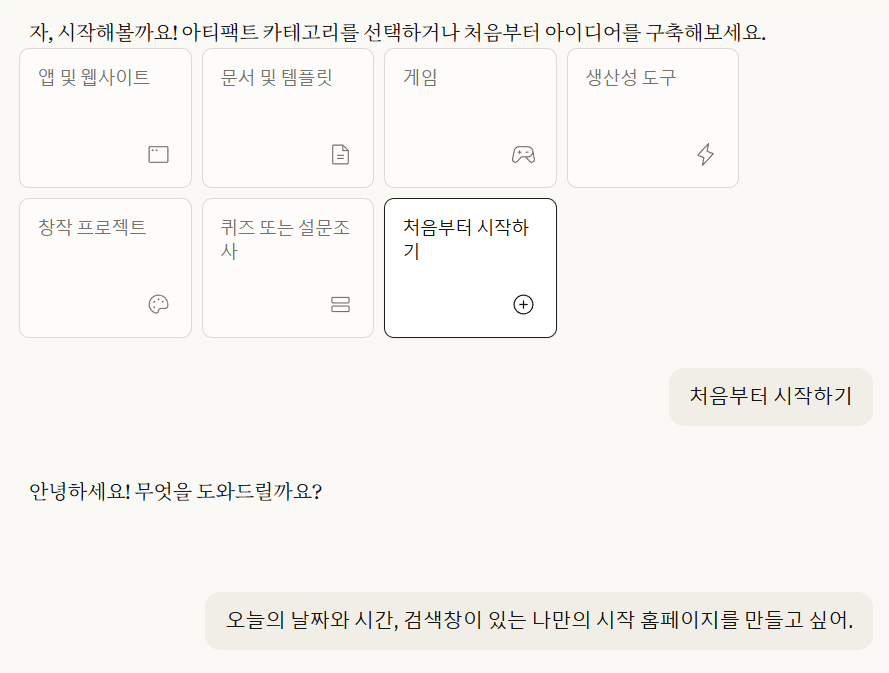

**1장 예제 안내 - 날씨/뉴스 API 이슈**

클로드 아티팩트의 외부 API 정책이 변경되어, 38페이지 예제에서 날씨와 뉴스를 불러올 수 없습니다. 해당 프롬프트를 아래와 같이 대체해 실행해 주세요.

> 오늘의 날짜와 시간, 검색창이 있는 나만의 시작 홈페이지를 만들고 싶어.

---

[참조] 새 아티팩트 선택 후 아래 사진처럼 **[처음부터 시작하기]** 를 선택하면 바로 프롬프트를 넣을 수 있습니다.

  

이후 추가 질문에 답하면 첫 아티팩트가 완성되고, "게시", "커스터마이즈" 등은 책의 내용 그대로 실행하시면 됩니다.
