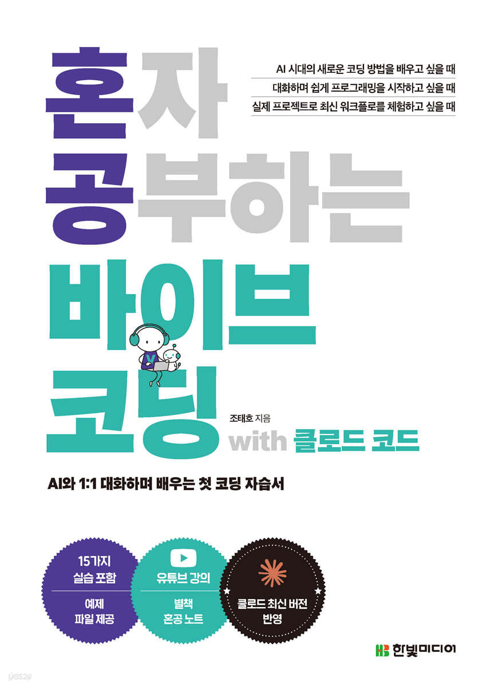
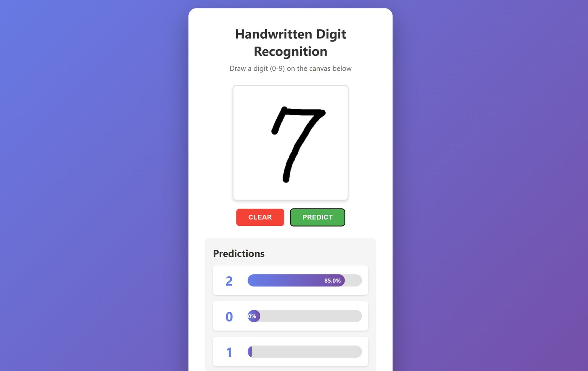
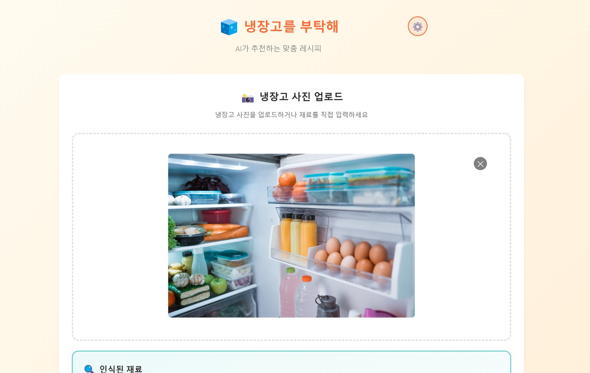

<h1 align="center">혼자 공부하는 바이브코딩 with 클로드코드</h1>

  

  
AI와 대화하며 코딩하는 새로운 개발 방식, <strong>바이브 코딩</strong>을 배워보세요. 
  클로드 코드와 함께 프롬프트만으로 웹 애플리케이션을 만들 수 있습니다.

  

    
    
    
  

---

  <h3>📱 실습 결과 일부 미리보기</h3>
  
<em>이미지를 클릭하면 라이브 데모를 바로 실행할 수 있습니다</em>

  <table>
    <tr>
      <td align="center">
        
         
        <strong>3장 예제: 손글씨 인식</strong>
      </td>
      <td align="center">
        
         
        <strong>6장 예제: 냉장고를 부탁해</strong>
      </td>
      <td align="center">
        
         
        <strong>7장 예제: 공감 AI 다이어리</strong>
      </td>
    </tr>
  </table>

---

▶️ **[유튜브 강의 전체 재생목록](https://www.youtube.com/playlist?list=PLwVlmsyd5oN5zmup3eAuCbKlu9TRXImA6)** - 책과 함께 보는 무료 강의

📝 **[전체 프롬프트 모음 보기](PROMPTS.md)** - 교재의 안내에 따라 프롬프트를 사용하세요.

📋 **[정오표 보기](https://raw.githubusercontent.com/taehojo/vibecoding/master/정오표-20260120.pdf)** - 2026.1.20 업데이트

---

✨ **이어서 배우기 - 책 이후의 업데이트**

[01 플러그인(Plugin) 활용해서 디자인 수정하기](책이후의-업데이트-01/)

[02 마켓플레이스(Marketplaces)로 플러그인 설치하고 나만의 스킬 만들기](책이후의-업데이트-02/)

[03 스킬(Skill)로 업그레이드하는 바이브코딩](책이후의-업데이트-03/)

---

## 📖 목차

**1장: 나의 첫 바이브 코딩** [▶️ 유튜브 강의](https://www.youtube.com/watch?v=n6xAUiTTrZU) &nbsp; [📝 프롬프트](https://github.com/taehojo/vibecoding/blob/master/PROMPTS.md#01장-나의-첫-바이브-코딩)
- 01-1 나의 코딩 파트너, AI 어시스턴트
  - 바이브 코딩
  - AI 통합 도구의 등장
  - AI 어시스턴트의 탄생과 발전
- 01-2 AI로 나만의 첫 웹페이지 만들기
  - 클로드 시작하기
  - 클로드 아티팩트로 웹페이지 만들기
  - 웹페이지 게시하고 검토하기
  - 커스터마이즈 기능으로 개성 더하기
  - 클로드 구독으로 더 강력한 AI 파트너 만들기
>
> **예제**: 나만의 첫 웹페이지 - 날씨, 뉴스, 시계, 검색 기능을 포함한 개인 시작 페이지 (Claude Artifacts 사용)

**2장: 효과적인 프롬프트로 AI 200% 활용하기** [▶️ 유튜브 강의](https://youtu.be/n6xAUiTTrZU?si=SyUDw3tdkJWbv7LA&t=832) &nbsp; [📝 프롬프트](https://github.com/taehojo/vibecoding/blob/master/PROMPTS.md#02장-효과적인-프롬프트로-ai-200-활용하기)
- 02-1 AI를 깨우는 프롬프트의 비밀
  - 프롬프트의 중요성
  - 제품 기획서 초안 작성하기
- 02-2 실전! 마케팅 포트폴리오 완성하기
  - 4단계 포트폴리오 전략
  - 1단계: 뼈대
  - 2단계: 기능
  - 3단계: 디자인
  - 4단계: 점검

> **예제**: 마케팅 포트폴리오 웹사이트 - 채용 담당자가 30초 안에 역량 파악 가능한 포트폴리오 (히어로 섹션, 요약 섹션, 포트폴리오 섹션 단계별 구현)

**3장: 클로드 코드 시작하기** [▶️ 유튜브 강의](https://www.youtube.com/watch?v=i6ND1uIRF_g) &nbsp; [📝 프롬프트](https://github.com/taehojo/vibecoding/blob/master/PROMPTS.md#03장-클로드-코드-시작하기)
- 03-1 클로드 코드 설치하기
  - 실습 환경 준비하기
  - 터미널 실행하기
  - 클로드 코드
- 03-2 손글씨 인식 프로그램 만들기
  - 프로젝트 폴더 준비하기
  - MNIST 데이터세트로 숫자 인식 프로그램 만들기
- 03-3 CLAUDE.md로 프로그램 확장하기
  - 프로젝트 설정 파일의 이해
  - 계층적 구조 활용하여 웹 버전 손글씨 인식 프로그램 만들기
>
> **예제**: 손글씨 인식 프로그램 [🎯 라이브 데모](https://vibecoding-ch03.vercel.app) - MNIST 데이터셋을 활용한 숫자 인식 데스크톱 앱 + 웹 버전 확장 (계층적 폴더 구조 사용)

**4장: 클로드 코드 실전 활용** [▶️ 유튜브 강의](https://www.youtube.com/watch?v=EOnUXdUIXqQ) &nbsp; [📝 프롬프트](https://github.com/taehojo/vibecoding/blob/master/PROMPTS.md#04장-클로드-코드-실전-활용)
- 04-1 단계별 프롬프트와 함께 클로드 코드 명령어 익히기
  - 단계별 프롬프트 작성하기
  - 단계별 프롬프트 실행하기
  - 클로드 초기 설정 명령어
- 04-2 작업 재개와 효율성 높이기
  - 기능 추가하기
  - 컨텍스트 관리하기
- 04-3 프로젝트 개선과 작업 관리
  - 캡처 이미지로 데스크톱 버전 앱의 UI 개선하기
  - 참조를 통해 코드 빠르게 점검하기
  - 클로드 코드 프로젝트 관리하기

> **예제**: 할 일 관리 앱 [🎯 라이브 데모](https://taehojo.github.io/vibecoding/Study-02/) - 할 일 추가/수정/삭제, 카테고리 분류, 진행률 대시보드, 다크 모드 (웹 + PC 버전)

**5장: 게임 제작으로 배우는 체계적인 개발과 관리** [▶️ 유튜브 강의](https://www.youtube.com/watch?v=v4kZ4ErsxlU) &nbsp; [📝 프롬프트](https://github.com/taehojo/vibecoding/blob/master/PROMPTS.md#05장-게임-제작으로-배우는-체계적인-개발과-관리)
- 05-1 할루시네이션 없는 AI 콘텐츠 만들기
  - 1단계: 퀴즈 게임 구현하기
  - 할루시네이션 해결하기
- 05-2 자동화로 개발 효율 높이기
  - 2단계: 게임 확장하기
  - 커스텀 명령어로 반복 작업 자동화하기
  - 커스텀 명령어 확장하기
  - 새로운 퀴즈 문제 추가 자동화
- 05-3 명령어 체이닝으로 익히는 유지보수 전략
  - 3단계: 데이터 저장 및 순위 시스템
  - 게임 제작 워크플로 자동화하기
  - 클로드 코드가 스스로 만드는 커스텀 명령어
  - 효율적인 유지보수 워크플로 구축하기

> **예제**: 상식 퀴즈 게임 [🎯 라이브 데모](https://taehojo.github.io/vibecoding/Study-03/Study-03-advanced/) - 4지선다 객관식, 카테고리별 모드, 점수 시스템, 리더보드 (할루시네이션 검증 가이드라인 적용, 커스텀 명령어 자동화)

**6장: 클로드 코드에 API 날개 달기** [▶️ 유튜브 강의](https://www.youtube.com/watch?v=bPTzqCIp-uc) &nbsp; [📝 프롬프트](https://github.com/taehojo/vibecoding/blob/master/PROMPTS.md#06장-클로드-코드에-api-날개-달기)
- 06-1 클로드 코드에서 API 설정하기
  - API의 개념과 활용 방법
  - AI 모델 선택하기
  - AI 모델 연결하고 테스트하기
- 06-2 클로드 코드와 API로 만드는 '냉장고를 부탁해'
  - 애플리케이션 구현을 위한 PRD 작성하기
  - 1단계: 냉장고 이미지에서 재료 인식하기
  - 2단계: 레시피 생성하기
  - 3단계: 사용자 프로필에 레시피 저장하기

> **예제**: 냉장고를 부탁해 앱 [🎯 라이브 데모](https://vibecoding-ch06.vercel.app) - 냉장고 사진 업로드 ([📥 입력예제](https://raw.githubusercontent.com/taehojo/vibecoding/master/입력예제/냉장고2.jpg)) → 재료 인식 → 레시피 추천 → 사용자 프로필/저장 기능 (3단계 구현)

**7장: 클로드 코드 AI 에이전트로 개발팀 구성하기** [▶️ 유튜브 강의](https://www.youtube.com/watch?v=_kKX2kqBD58) &nbsp; [📝 프롬프트](https://github.com/taehojo/vibecoding/blob/master/PROMPTS.md#07장-클로드-코드-ai-에이전트로-개발팀-구성하기)
- 07-1 클로드 코드의 AI 에이전트 이해하기
  - 나의 첫 에이전트, 코드 리뷰어
  - 최적화 에이전트
  - UX 디자인 에이전트
  - 서브에이전트 협업 테스트하기
  - 작업 결과 백업하기
- 07-2 AI 에이전트로 소프트웨어 개발 자동화하기
  - 나만의 AI 개발팀 구축하기
  - 에이전트 팀과 완성하는 애플리케이션, 'AI 공감 다이어리'
  - 에이전트 팀과 완성하는 애플리케이션, 'PDF 요약 AI'

> **예제**:
> - AI 공감 다이어리 앱 [🎯 라이브 데모](https://vibecoding-ch07.vercel.app): 하루 일기 입력 → 감정 분석 → 공감 메시지 생성 (에이전트 협업: 백엔드, 프론트, QA)
> - PDF 문서 요약 AI [🎯 라이브 데모](https://vibecoding-ch07.vercel.app/pdf): PDF 업로드 ([📥 입력예제](https://raw.githubusercontent.com/taehojo/vibecoding/master/입력예제/한글맞춤법.pdf)) → 텍스트 추출 → 요약/분석 (5 에이전트 협업: 기획, 백엔드, AI 통합, 프론트, QA)

**8장: MCP로 클로드 코드의 한계 넘어서기** [▶️ 유튜브 강의](https://www.youtube.com/watch?v=owhCgXcax_o) &nbsp; [📝 프롬프트](https://github.com/taehojo/vibecoding/blob/master/PROMPTS.md#08장-mcp로-클로드-코드의-한계-넘어서기)
- 08-1 MCP 이해하고 클로드 코드와 연결하기
  - MCP가 열어준 AI의 무한 확장 가능성
  - 클로드 코드와 노션 연결하기
  - 순차적 추론 MCP로 더 똑똑한 AI 만들기
  - 순차적 추론 MCP의 성능 확인하기
- 08-2 MCP로 구현하는 완전 자동화 개발 환경
  - 원하는 MCP를 찾는 방법
  - 쇼핑 리스트 애플리케이션 만들고 MCP로 테스트 자동화하기
  - 깃허브 MCP로 프로젝트 영구 보관하기
- 08-3 데이터베이스 연결해 진짜 서비스 만들기
  - 나만의 웹페이지 배포하기
  - 애플리케이션에 데이터베이스 연동하기
  - 쇼핑 리스트 앱 진짜 서비스로 업그레이드하기

> **예제**: 쇼핑 리스트 앱 [🎯 라이브 데모](https://shopping-list-app-chi-blush.vercel.app) - Playwright 자동 테스트 → 깃허브 업로드 → Vercel 배포 → Supabase 데이터베이스 연동으로 완성도 높은 실전 서비스 구축

---

## 📦 실습 결과 폴더 안내

각 챕터의 실습 결과물이 저장된 폴더와 실습 내용은 다음과 같습니다.

| 챕터 | 폴더명 | 실습 내용 | 바로가기 |
|:---:|:---:|:---|:---:|
| 3장 | `Study-01` | 손글씨 인식 프로그램 | [🎯 라이브 데모](https://vibecoding-ch03.vercel.app) |
| 4장 | `Study-02` | 할 일 관리 앱 | [🎯 라이브 데모](https://taehojo.github.io/vibecoding/Study-02/) |
| 5장 | `Study-03-basic` | 상식 퀴즈 게임 (기본) | [📥 다운로드](https://download-directory.github.io/?url=https://github.com/taehojo/vibecoding/tree/master/Study-03/Study-03-basic) |
| 5장 | `Study-03-advanced` | 상식 퀴즈 게임 (고급) | [🎯 라이브 데모](https://taehojo.github.io/vibecoding/Study-03/Study-03-advanced/) |
| 6장 | `Study-04` | 냉장고를 부탁해 (AI 레시피 추천) | [🎯 라이브 데모](https://vibecoding-ch06.vercel.app) |
| 7장 | `Study-05` | 공감 AI 다이어리 | [🎯 라이브 데모](https://vibecoding-ch07.vercel.app) |
| 7장 | `Study-05` | PDF 문서 요약 AI | [🎯 라이브 데모](https://vibecoding-ch07.vercel.app/pdf) |
| 8장 | `Study-06` | 쇼핑 리스트 앱 (데이터베이스 연동) | [🎯 라이브 데모](https://shopping-list-app-chi-blush.vercel.app) |

---

## 🛠️ 클로드 코드 설치 가이드 (맥, 리눅스)

교재의 Windows 환경이 아닌 분들을 위한 설치 방법입니다.

- **[macOS 설치 가이드](설치가이드/INSTALL-MAC.md)** - Mac 사용자를 위한 설치 안내
- **[Linux 설치 가이드](설치가이드/INSTALL-LINUX.md)** - Linux 사용자를 위한 설치 안내

---

## 📢 소식 & 활동

**[혼공 바이브코딩 집필 에피소드 (저자 인터뷰)](https://www.hanbit.co.kr/channel/view.html?cmscode=CMS3592606738)**

**[[6주 과정] 혼자 공부하는 바이브 코딩 완독 챌린지](https://www.inflearn.com/challenge/6%EC%A3%BC-%EA%B3%BC%EC%A0%95-%ED%98%BC%EC%9E%90-%EA%B3%B5%EB%B6%80%ED%95%98%EB%8A%94-%EB%B0%94%EC%9D%B4%EB%B8%8C-%EC%BD%94%EB%94%A9)**

모집 마감, 현재 진행중

**[조태호 저자와 함께하는 바이브 코딩 AI 프로젝트 실전 특강](https://event-us.kr/hanbitn/event/118798)**

클로드 코드 설치부터 에이전트, MCP, 스킬까지 바이브 코딩 전 과정 안내 (행사 종료, 한빛⁺에서 강의 영상 제공 예정)
