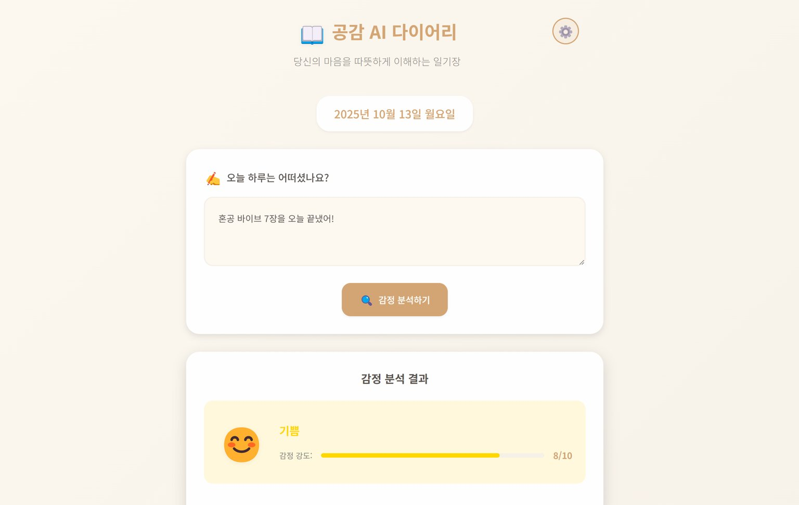

# 혼자 공부하는 바이브코딩 with 클로드코드

  <h3>📱 실습 결과 일부 미리보기</h3>
  
<em>이미지를 클릭하면 라이브 데모를 바로 실행할 수 있습니다</em>

  <table>
    <tr>
      <td align="center">
        
         
        <strong>3장 예제: 손글씨 인식</strong>
      </td>
      <td align="center">
        
         
        <strong>6장 예제: 냉장고를 부탁해</strong>
      </td>
      <td align="center">
        
         
        <strong>7장 예제: 공감 AI 다이어리</strong>
      </td>
    </tr>
  </table>

---

📝 **[전체 프롬프트 모음 보기](PROMPTS.md)** - 교재의 안내에 따라 프롬프트를 사용하세요.

---

## 📖 목차

### 첫째 마당 | AI와 코딩의 만남

**Chapter 1: 나의 첫 바이브 코딩**
- 바이브 코딩의 기본 개념과 AI 어시스턴트의 역사 및 발전 과정 소개
- 다양한 코딩 도구 비교: 웹 기반 챗봇, 모델 선택형, 전용 모델형
- Claude 웹 인터페이스를 활용한 AI 코딩 기초 체험
>  
> **예제**: 나만의 첫 웹페이지 - 날씨, 뉴스, 시계, 검색 기능을 포함한 개인 시작 페이지 (Claude Artifacts 사용)

**Chapter 2: 효과적인 프롬프트로 성능 200% 활용하기**
- 좋은 프롬프트의 조건과 작성법 (5W1H, PRD)
- 막연한 아이디어를 구체적인 기획서로 변환하는 과정
- 4단계 전략: 기본 틀 잡기 → 핵심 기능 넣기 → 디자인 입히기 → 완성도 점검

> **예제**: 마케팅 포트폴리오 웹사이트 - 채용 담당자가 30초 안에 역량 파악 가능한 포트폴리오 (히어로 섹션, 요약 섹션, 포트폴리오 섹션 단계별 구현)

### 둘째 마당 | 클로드 코드와 함께하는 실전 코딩

**Chapter 3: 클로드 코드 시작하기: 터미널에서 만드는 첫 프로그램**
- 클로드 코드 설치와 터미널 환경 설정
- CLI 방식의 코딩 실습
- CLAUDE.md 파일과 계층 구조를 활용한 프로젝트 관리
>  
> **예제**:
>
> - 손글씨 인식 프로그램: MNIST 데이터셋을 활용한 숫자 인식 데스크톱 앱 (파이썬 코드 작성, 독립 실행 파일 생성)
> - 웹 버전 손글씨 인식 프로그램: 데스크톱 버전을 웹으로 확장 (계층적 폴더 구조 사용)

**Chapter 4: 할 일 관리 앱 만들기: 클로드 코드 실전 활용**
- 클로드 웹과 코드 연계 워크플로우
- 단계별 프롬프트로 앱 개발하기
- 세션 재개, 컨텍스트 최적화, 파일 참조 등 명령어 실습

> **예제**:
> - 할 일 관리 웹 앱: 할 일 추가/수정/삭제, 카테고리 분류, 진행률 대시보드, 다크 모드 (5단계 구현)
> - PC 버전 할 일 관리 앱: 모바일 중심 디자인을 PC 최적화 (스크린 캡처 활용 디자인 개선)

**Chapter 5: 미니 게임 제작으로 배우는 클로드 코드 고급 활용**
- AI 할루시네이션 방지와 콘텐츠 검증 방법
- 커스텀 명령어와 체이닝을 활용한 자동화
- 선택적 업데이트 전략

> **예제**:
> - 상식 퀴즈 게임: 4지선다 객관식 퀴즈 (카테고리별 모드, 점수 시스템, 리더보드, 할루시네이션 검증 가이드라인 적용)
> - 선생님 모드 확장: 학생 성적 분석 및 보고서 생성 (체이닝으로 통합 자동화, 상대평가 등급 시스템)

### 셋째 마당 | 클로드 코드로 프로처럼 일하기

**Chapter 6: 클로드 코드에 API 날개 달기**
- API 개념과 연동 방법
- 오픈라우터를 통해 무료 AI 모델 활용
- 단계별 실용적인 앱 개발

> **예제**: 냉장고를 부탁해 앱 - 냉장고 사진 업로드 ([입력예제1](https://raw.githubusercontent.com/taehojo/vibecoding/master/입력예제/냉장고.jpg), [입력예제2](https://raw.githubusercontent.com/taehojo/vibecoding/master/입력예제/냉장고2.jpg)) → 재료 인식 (Llama 모델) → 레시피 추천 (DeepSeek 모델) → 사용자 프로필/저장 기능 (3단계 구현)

**Chapter 7: 클로드 코드 AI 에이전트로 개발팀 구성하기**
- 에이전트 개념과 생성 방법
- 역할 분담과 협업 실습
- AI 개발팀을 구성해 복잡한 앱 자동화

> **예제**:
> - 공감 AI 다이어리 앱: 하루 일기 입력 → 감정 분석 → 공감 메시지 생성 (에이전트 협업: 백엔드, 프론트, QA)
> - PDF 문서 요약 AI: PDF 업로드 ([입력예제](https://raw.githubusercontent.com/taehojo/vibecoding/master/입력예제/한글맞춤법.pdf)) → 텍스트 추출 → 요약/분석 (5 에이전트 협업: 기획, 백엔드, AI 통합, 프론트, QA)

**Chapter 8: MCP로 클로드 코드의 한계 넘어서기**
- MCP 프로토콜의 개념과 AI 확장 가능성
- MCP 환경 구축 및 서버 설치 (노션, 순차적 추론 MCP)
- MCP 서버 검색 및 설치 방법 (Context7, Playwright)
- 자동 테스트, 깃허브 연동, Vercel 배포 실습
- Supabase 데이터베이스 연동 및 실시간 동기화

> **예제**: 쇼핑 리스트 앱 - Playwright 자동 테스트 → 깃허브 업로드 → Vercel 배포 → Supabase 데이터베이스 연동으로 완성도 높은 실전 서비스 구축

---

## 📦 프로젝트

각 Chapter의 완성된 실습 프로젝트입니다. 🎯 라이브 데모를 클릭하여 바로 실행해보세요!

### Chapter 3: 손글씨 인식 프로그램
- **Study-01**: [🎯 라이브 데모](https://vibecoding-ch03.vercel.app)

### Chapter 4: 할 일 관리 앱
- **Study-02**: [🎯 라이브 데모](https://taehojo.github.io/vibecoding/Study-02/)

### Chapter 5: 상식 퀴즈 게임
- **Study-03-basic** (기본): [📥 다운로드](https://download-directory.github.io/?url=https://github.com/taehojo/vibecoding/tree/master/Study-03/Study-03-basic) (실습 참조용)
- **Study-03-advanced** (고급): [🎯 라이브 데모](https://taehojo.github.io/vibecoding/Study-03/Study-03-advanced/)

### Chapter 6: 냉장고를 부탁해 (AI 레시피 추천)
- **Study-04**: [🎯 라이브 데모](https://vibecoding-ch06.vercel.app)

### Chapter 7: 공감 AI 다이어리, PDF 문서 요약 AI
- **Study-05 (공감 AI 다이어리)**: [🎯 라이브 데모](https://vibecoding-ch07.vercel.app)
- **Study-05 (PDF 문서 요약 AI)**: [🎯 라이브 데모](https://vibecoding-ch07.vercel.app/pdf)

### Chapter 8: 쇼핑 리스트 앱 (데이터베이스 연동)
- **Study-06**: [🎯 라이브 데모](https://shopping-list-app-chi-blush.vercel.app)

---

## 📖 더 알아보기

**[혼공 바이브코딩 집필 에피소드](https://www.hanbit.co.kr/channel/view.html?cmscode=CMS3592606738)**
