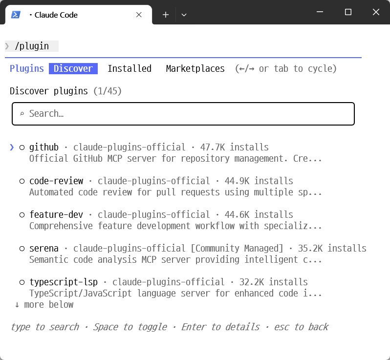
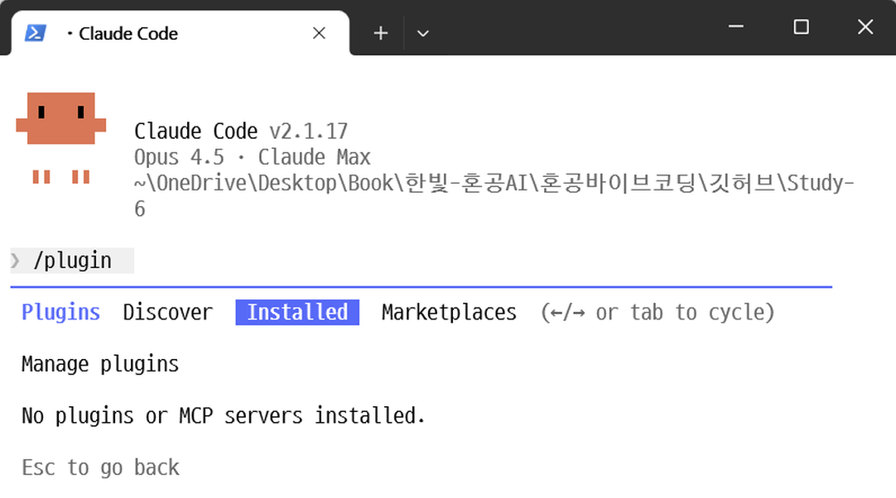
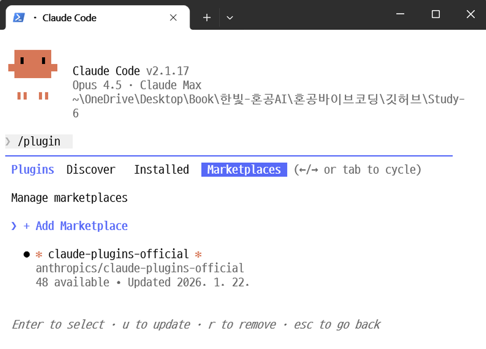
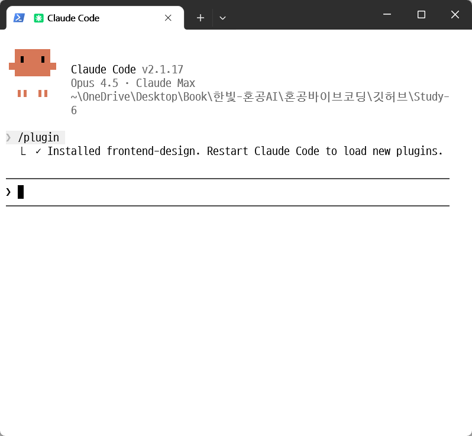
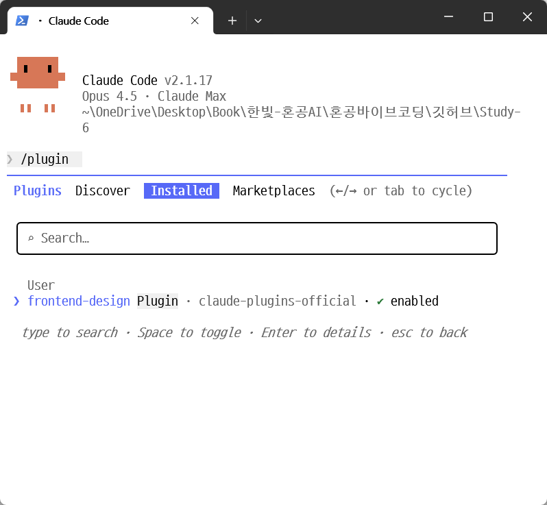
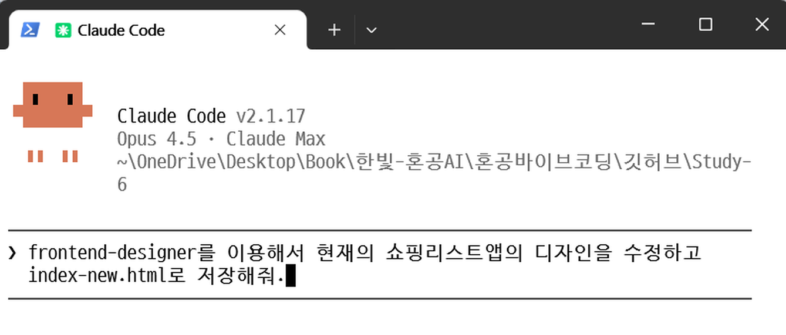
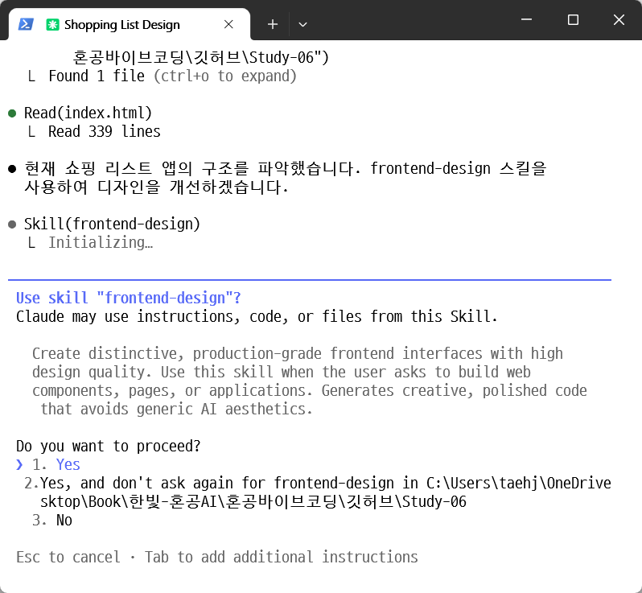
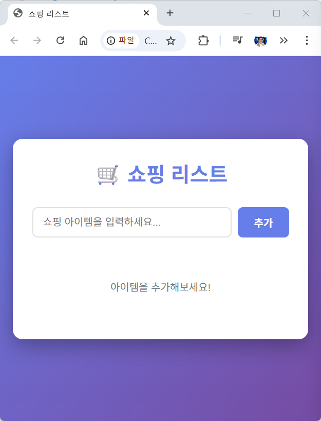
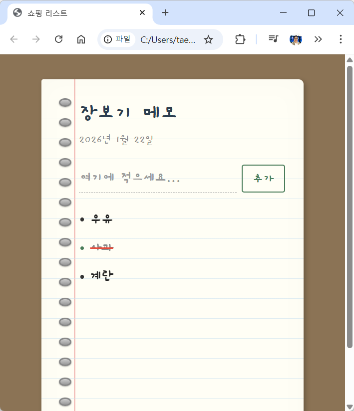

# 책 이후의 업데이트 -01 플러그인(Plugin) 활용해서 디자인 수정하기

## 개요

플러그인은 클로드 코드에 새로운 기능을 추가할 수 있는 확장 도구입니다. 이번 편에서는 플러그인을 설치해 보고 이를 통해 이전에 만든 쇼핑 리스트앱의 디자인을 개선해 보겠습니다. 쇼핑리스트 앱을 만든 VibeCoding\Study-06 폴더에서 클로드 코드를 시작합니다.

## Step 1: /plugin 명령어 실행

클로드 코드 실행후, `/plugin` 이라고 입력해 보면 /plugin을 설치, 삭제할 수 있는 메뉴가 나옵니다.

`/plugin`을 실행하면, **Discover**가 선택이 된 채로, 현재 설치가 가능한 plugin들의 목록이 하단에 보여집니다.

## Step 2: 플러그인 메뉴 살펴보기

좌우 화살표키를 이용해 다른 메뉴를 볼 수 있습니다. 오른쪽 화살표키를 눌러 **Installed** 탭을 보면 아직 아무 플러그인도 설치하지 않았기 때문에 비어 있습니다.

다시한 번 오른쪽 키를 눌러 **Marketplaces** 메뉴를 보면, 현재 클로드 코드에 설치된 마켓 플레이스를 볼 수 있습니다. 마켓플레이스는 플러그인이나 스킬 등을 한곳에 모아 설치 및 관리하기 쉽게 정리해 놓은 곳이라고 할 수 있습니다. 지금은 claude의 오피셜 플러그인 마켓 플레이스밖에 없다고 나옵니다. 이 마켓플레이스에서 제공하는 플러그인 들이 바로 Discover메뉴에서 보여졌던 플러그인 들입니다.

## Step 3: frontend-design 플러그인 설치

이번엔 왼쪽 화살표를 눌러, 다시 Discover 메뉴로 돌아와 여러 플러그인들 중 하나인 **frontend-design**을 설치하겠습니다. 아래 화살표를 눌러서 원하는 해당 플러그인을 선택한 후 엔터를 누르면 아래와 같이 보입니다.

어떤 사용범위를 지정해서 설치할지를 고르는 옵션이 나옵니다. **Install for you**를 선택해서 내가 사용하는 클로드 코드 모두에서 이 플러그인을 사용할 수 있도록 하겠습니다.

플러그인이 설치되었다고 나옵니다. 이제 클로드 코드를 재시작해야 합니다.

## Step 4: 클로드 코드 재시작

`/exit`를 눌러서(혹은 Ctrl+C키를 두번 눌러서) 클로드 코드를 종료한 뒤 다시 시작합니다.

이제 오른쪽 화살표 키를 눌러 Installed를 보면 조금전 설치한 플러그인이 설치되었음을 알 수 있습니다.

## Step 5: 플러그인으로 디자인 수정

이제 이 플러그인을 이용해서 쇼핑리스트 앱의 디자인을 수정하겠습니다.

실행시키면 아래와 같이 frontend-design 이 활성화되어 작업을 시작합니다. 이때 frontend-design이 다음 절에서 배울 '스킬(skills)'로 동작한다는 것을 알 수 있습니다.

## Step 6: 결과 확인

index-new.html이 지금 설치한 플러그인을 통해 수정완료 되었음을 알려 줍니다.

디자인 작업을 마친 결과를 확인합니다. 이전과 비교했을 때 달라진 디자인을 볼 수 있습니다.

| 이전 | frontend-design 플러그인 적용 결과 |
|:---:|:---:|
|  |  |

## 라이브 데모

🎯 **[리디자인된 쇼핑 리스트 보기](https://taehojo.github.io/vibecoding/책이후의-업데이트-01/)**

## 핵심 포인트

- **플러그인**: 클로드 코드에 새로운 기능을 추가할 수 있는 확장 도구입니다
- **Discover**: 설치 가능한 플러그인 목록을 확인하는 메뉴입니다
- **Marketplaces**: 플러그인이나 스킬을 한곳에 모아 정리해 놓은 곳입니다
- **frontend-design**: 디자인 전문가의 관점에서 UI를 개선하는 플러그인으로, 내부적으로는 '스킬(skills)'로 동작합니다
