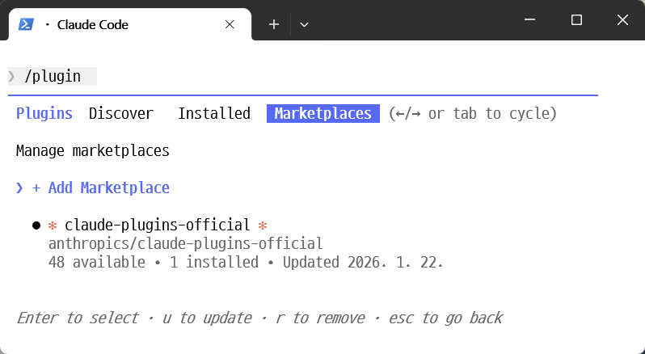
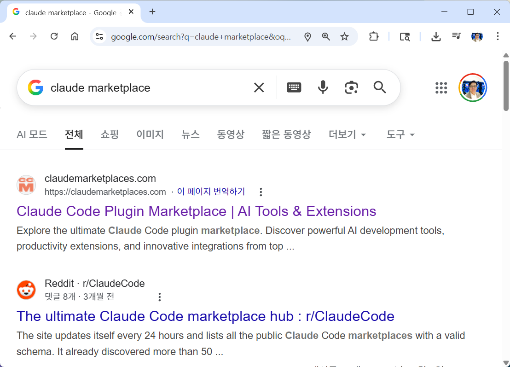
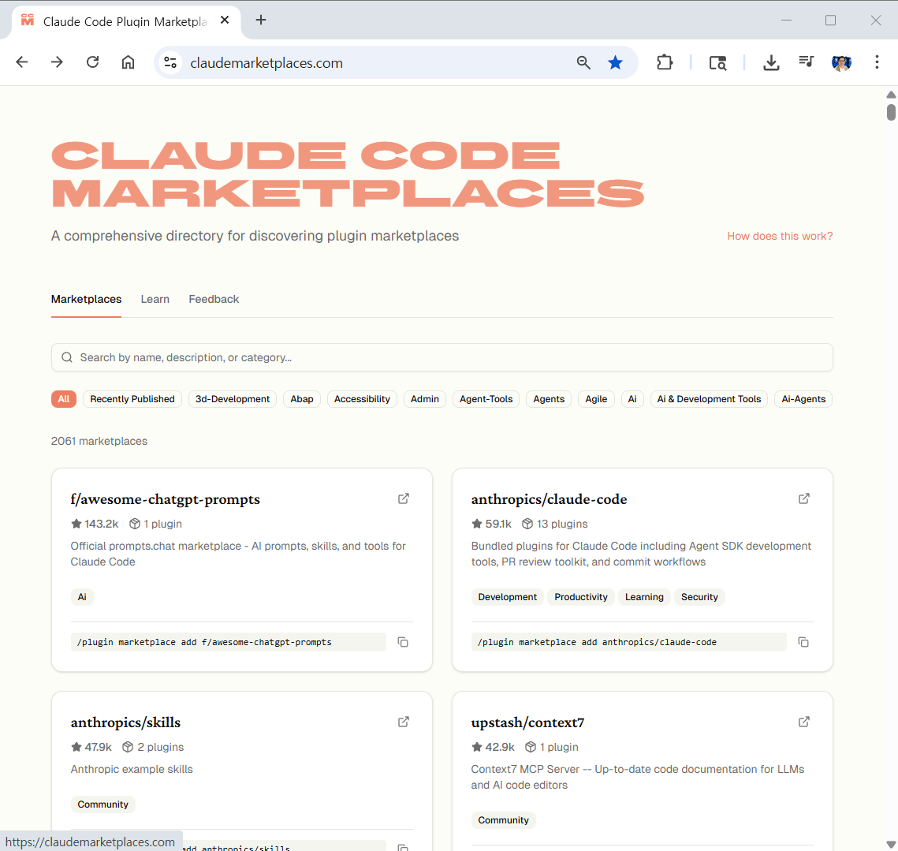
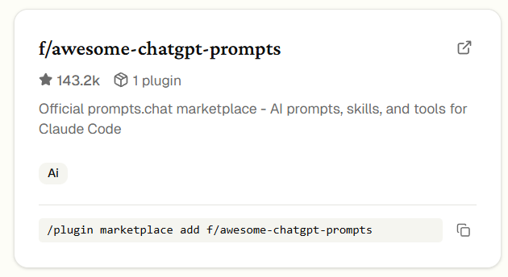
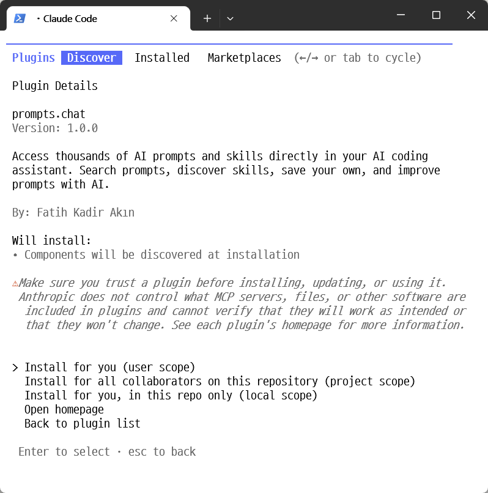
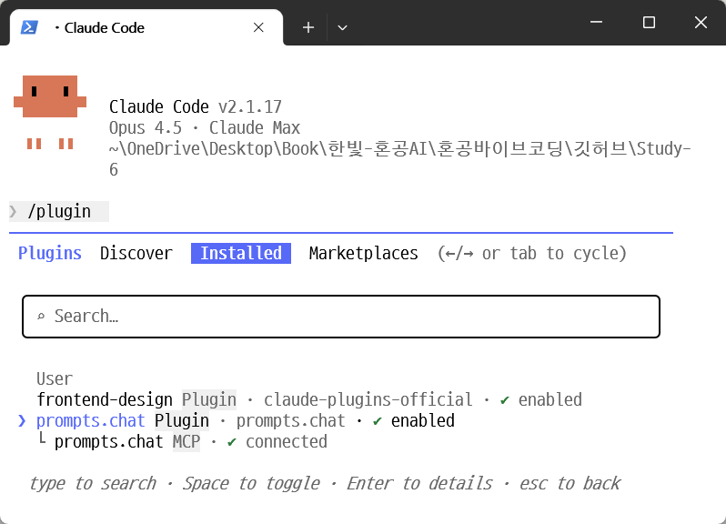
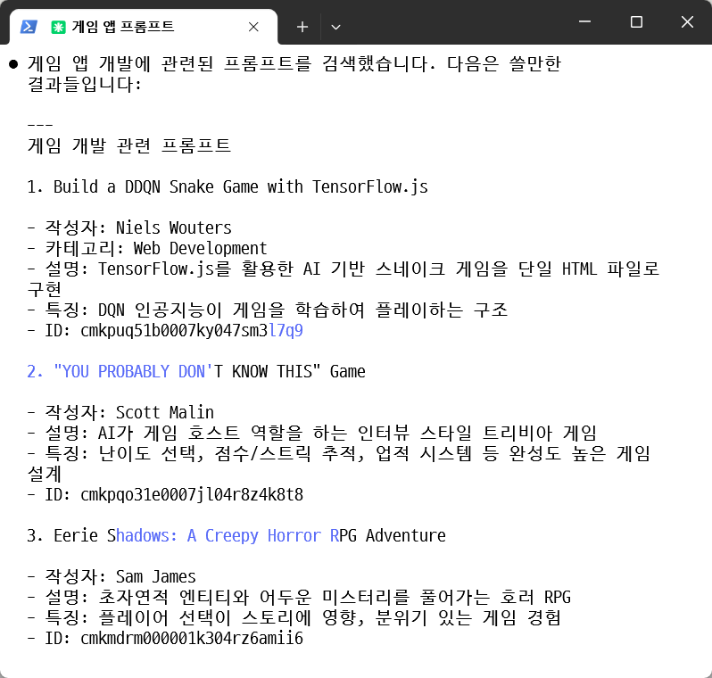
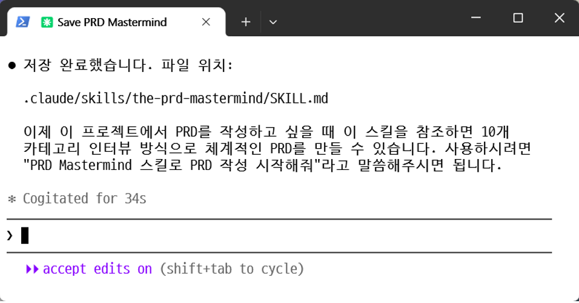
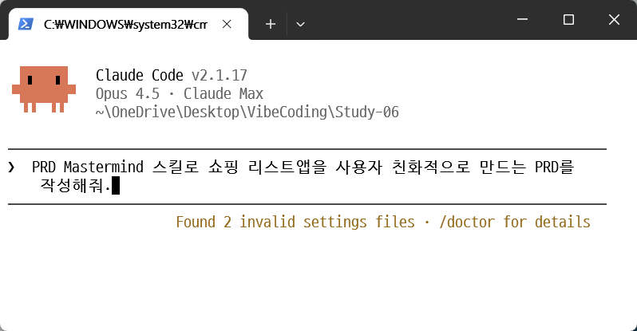
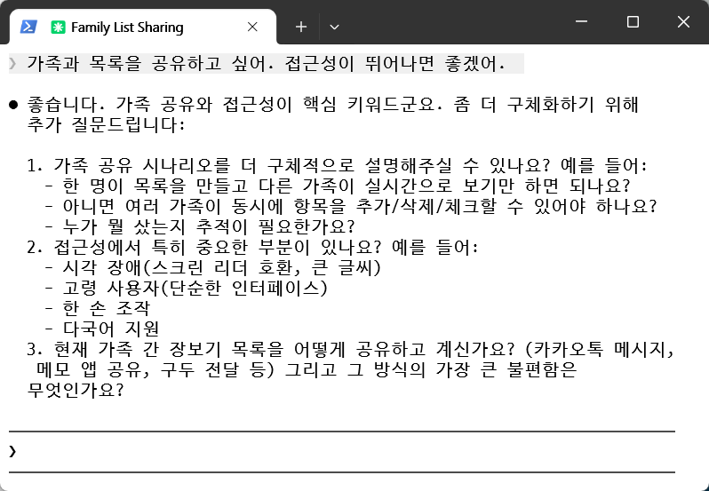

# 책 이후의 업데이트 - 마켓플레이스로 플러그인 설치하고 나만의 스킬 만들기

## 개요

앞서 잠시 나왔던 마켓플레이스는 클로드 코드에서 사용할 수 있는 다양한 플러그인이나 MCP, 스킬들을 배포하는 저장소입니다. 마치 스마트폰의 앱스토어처럼, 다른 개발자들이 만든 유용한 도구들을 한 곳에서 찾아 바로 설치할 수 있어 개발 환경을 빠르게 확장할 수 있습니다. 이번 편에서는 마켓플레이스를 설치하고, 프롬프트 검색 플러그인을 활용한 뒤, 검색된 프롬프트를 스킬로 저장해 PRD를 만들어 보겠습니다.

## Step 1: Marketplaces 메뉴 확인

화살표키를 이용해 Marketplaces를 선택하면 현재 설치된 마켓플레이스들이 나옵니다.



이때 Add Marketplace가 선택된 상태에서 엔터를 치면 다음과 같이 새로운 마켓플레이스를 설치할 수 있는 화면이 표시됩니다.


## Step 2: 마켓플레이스 검색하기

내게 필요한 마켓플레이스를 구글에서 찾아 보겠습니다. 검색창에 claude marketplace를 넣고 검색하면 이와 관련된 웹사이트들이 검색됩니다.



그중 https://claudemarketplaces.com/에 접속해 보겠습니다.



맨 처음에 나오는 f/awesome-chatgpt-prompts를 설치해 보겠습니다. 프롬프트를 여러 사용자들이 모아서 공유하는 서비스를 쓰게 해 주는 플러그인입니다.



## Step 3: 마켓플레이스 설치하기

설치 명령어 부분을 복사합니다.

```
/plugin marketplace add f/awesome-chatgpt-prompts
```

이것을 그대로 클로드 코드의 프롬프트에 입력하면 설치가 됩니다. 아래와 같이 이미 Add Marketplace에 들어와 있다면, 아래와 같이 f/awesome-chatgpt-prompts 부분만 입력합니다.


그러면 이전에 보이지 않았던 플러그인이 나타납니다. 이는 새로 설치된 마켓플레이스로부터 제공된 플러그인입니다.


설치를 위해 엔터를 치고 Install for you를 눌러 설치합니다.



설치후 클로드를 재시작합니다. 다시 /plugin을 눌러 Installed를 확인해 보면 방금 새로 설치된 프롬프트용 플러그인이 연결되었다고 나옵니다.



## Step 4: 플러그인으로 프롬프트 검색하기

확인후 esc를 눌러 다시 프롬프트를 입력할 준비를 합니다. 이제 예를 들어 다음과 같이 입력해 보겠습니다.


그러면 자동으로 지금 설치한 promptus.chat이라는 플러그인을 불러와 사용하겠다고 알립니다. Yes를 눌러 계속 진행합니다.


그러면 다음과 같이 쓸만한 프롬프트들을 제안해 줍니다.



마찬가지로 "PRD를 생성하는 프롬프트"를 검색해 보면 다음과 같이 찾아줍니다.


## Step 5: PRD Mastermind를 스킬로 저장하기

이제 이중에서 첫번째로 검색된 PRD Mastermind를 실제로 사용해 보겠습니다. 아래와 같이 입력합니다.


> The PRD Mastermind를 SKILL.md로 저장해서 앞으로 사용할 수 있게 해줘.

여기서 주의할 것은 SKILL.md 파일로 저장하라고 했다는 것입니다. 앞서 플러그인을 배울 때, frontend-design을 설치했는데 실제로 실행될때는 frontend-design skill을 이용해 실행되었다는 것을 기억해 보시기 바랍니다. 스킬은 미리 저장된 지침을 가져와 효율적으로 사용할 수 있는 편리한 기능입니다. MCP와 달리 필요할때만 불러와 사용하므로 토큰 사용량이 적어 더 경제적인 방식입니다. 이 스킬은 .claude/skills이라는 폴더에 SKILL.md 파일로 저장됩니다.


실행하면 이와 같이 Study-06 폴더의 .claude\skills 폴더안에 "the-prd-mastermind"라는 폴더를 만들고 그 안에 SKILL.md 파일로 저장한다고 안내가 나옵니다. 이때 사용되는 폴더이름, 여기서는 the-prd-mastermind가 이 스킬의 이름이 됩니다. Yes를 눌러 진행하겠습니다.



## Step 6: 스킬을 이용해 PRD 만들기

이제 PRD를 만드는 스킬을 제작했습니다. 이 스킬을 이용해서 PRD를 만들어 보겠습니다.



그러면 아래와 같이 해당 스킬을 사용해 PRD작성을 시작하고 이에 필요한 질문들을 물어보면서 PRD 작성을 시작하게 됩니다.


이를 적절히 작성하면 좋은 PRD를 위해 마치 기획자가 인터뷰하듯 질문들이 이어집니다.



질문에 답을 마치면 PRD작성을 시작합니다.


이제 다 만들어진 PRD를 확인해 보겠습니다.


상당히 길고, 전문적인 PRD가 만들어졌습니다. 이처럼 마켓플레이스를 통해 필요한 플러그인을 설치하고, 이를 프로젝트에 활용할 수 있습니다.

## 핵심 포인트

- **마켓플레이스(Marketplaces)**: 클로드 코드에서 사용할 수 있는 플러그인, MCP, 스킬들을 배포하는 저장소입니다
- **마켓플레이스 설치**: `/plugin marketplace add` 명령어로 새로운 마켓플레이스를 추가할 수 있습니다
- **스킬(Skill)**: 미리 저장된 지침을 가져와 효율적으로 사용할 수 있는 기능으로, MCP와 달리 필요할때만 불러와 사용하므로 더 경제적입니다
- **SKILL.md**: `.claude/skills` 폴더에 저장되며, 폴더 이름이 스킬의 이름이 됩니다
