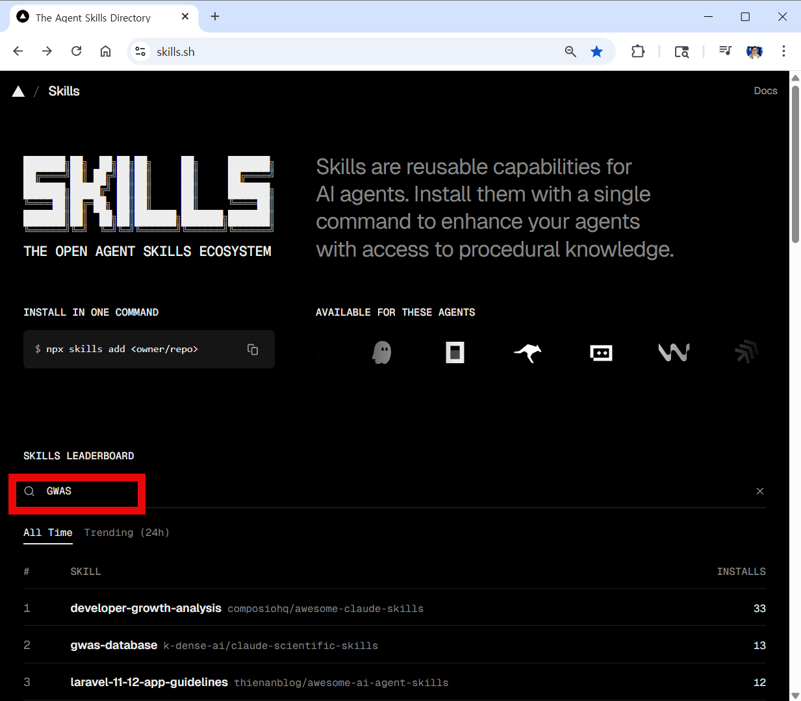
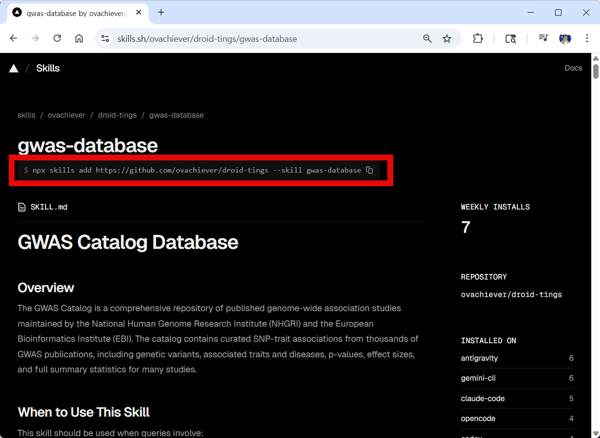
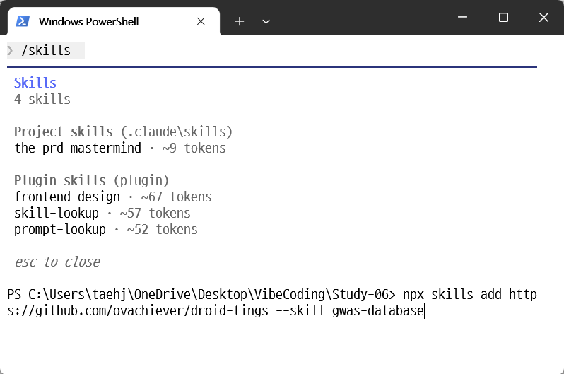
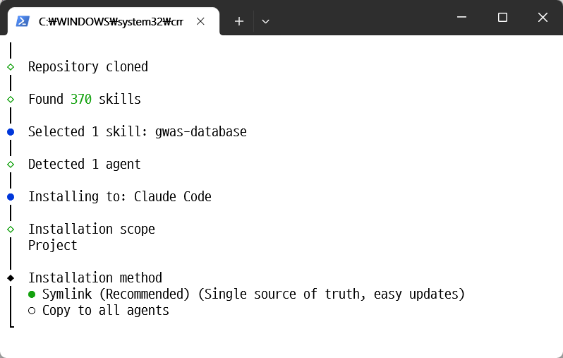
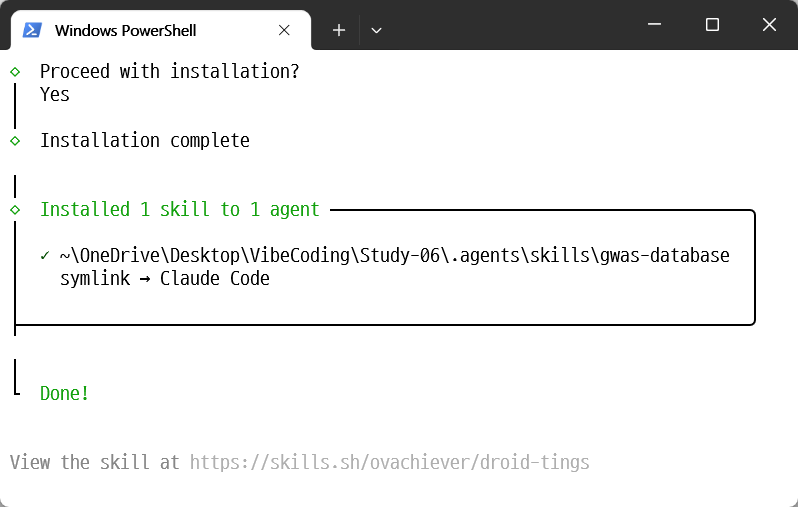
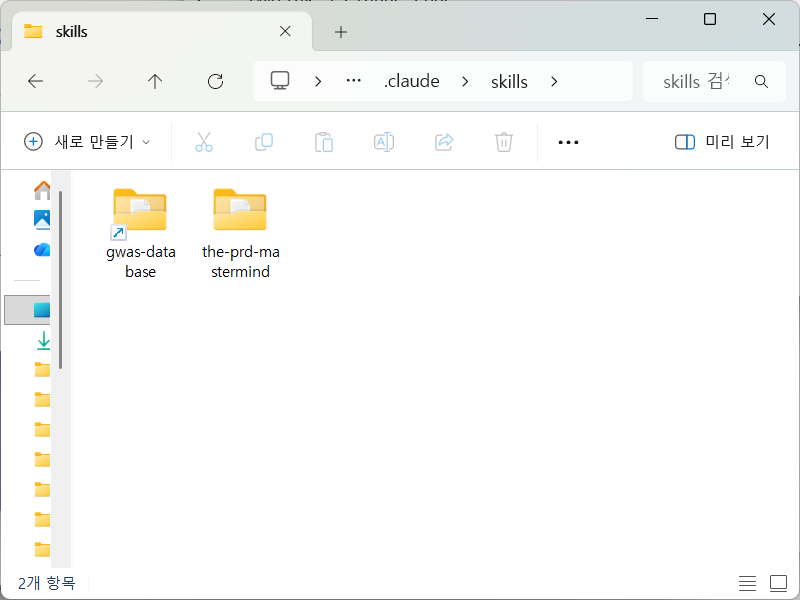
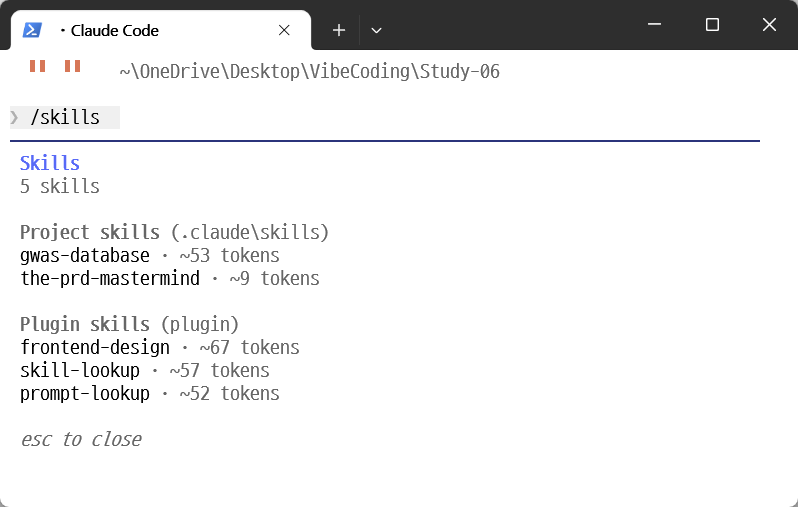
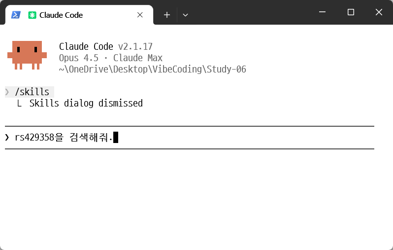

# 책 이후의 업데이트 -03 스킬(Skill)로 업그레이드하는 바이브코딩

## 개요

앞서 우리는 직접 스킬을 설치해서 활용해 보았습니다. 지금부터는 이미 만들어진 적절한 스킬을 가져와 클로드 코드에 추가하는 방법을 알아보겠습니다.

## Step 1: 현재 설치된 스킬 확인

/skills 명령어는 현재 설치된 스킬을 확인하게 해줍니다.


마켓플레이스 설치 및 스킬 생성 편에서 만든 the-prd-mastermind 스킬이 보입니다. 그리고, 앞서 플러그인을 설치할 때 가져온 스킬들도 보입니다.

## Step 2: skills.sh에서 스킬 검색하기

스킬들이 모아져 있는 사이트는 꽤 많은데 그중에서 www.skills.sh 라는 사이트를 보면 다음과 같이 스킬들이 설치된 숫자로 정렬되어 있어서 가장 잘 쓰이는 스킬들을 확인하고 수천개 이상의 스킬들 중에서 내게 필요한 것을 검색해 볼 수 있습니다.


이중 원하는 스킬을 찾고 설치하는 방법을 예를 들어 실행해 보겠습니다. Skills.sh 웹사이트의 검색창에 유전체 분석에서 쓰이는 대표적인 기법인 GWAS라는 키워드를 입력해 보겠습니다.



GWAS(Genome-wide association study)는 유전체에 대한 연관성을 분석하는 연구방법입니다. 검색하면 이를 지원하게 해주는 스킬들이 수십개 이상 검색됩니다. 이중 gwas-database를 선택해 보겠습니다.

그러면 해당 스킬의 설치를 위한 명령어가 아래와 같이 보입니다.

```
npx skills add https://github.com/ovachiever/droid-tings --skill gwas-database
```



## Step 3: 스킬 설치하기

이것을 클로드 코드에서 사용하게끔 해 보겠습니다. 먼저 클로드 코드에서 빠져나와 터미널로 이동합니다. 그리고 위에서 복사한 명령어를 그대로 붙여 넣고 실행합니다.




그러면 스킬을 설치하기 위한 안내화면이 나옵니다. 지금 선택한 스킬이 무엇이고 어떤 범위로 설치할지를 선택하게 합니다. Project를 선택해 현재 프로젝트에서만 사용하게끔 하겠습니다.



심볼릭 링크를 만들지, 아니면 직접 다운받아 복사할지를 선택해야 합니다. 추천하는 대로 심볼릭 링크를 선택하겠습니다. 설치가 완료되면 아래와 같이 나옵니다.



## Step 4: 설치된 스킬 확인하기

.claude\skills 폴더에 보시면 지금 설치한 gwas-database라는 스킬이 설치된 것을 알 수 있습니다.



클로드 코드를 실행해 다시 /skills를 실행하시면 조금전 설치한 새 스킬이 보입니다.



## Step 5: 스킬 사용하기

이제 이 스킬을 사용해 보겠습니다. 스킬로 등록된 것은 클로드 코드가 판단해서 이 스킬이 필요하다고 여겨질 때 자동으로 불러오게 됩니다. 예를 들어 알츠하이머와 깊은 관련을 가진 rs429358이라는 유전변이를 집어 넣어 보겠습니다.



그러면 이것이 유전변이라는 것을 파악한 후 아래와 같이 지금 가진 스킬중에 gwas-database라는 스킬을 이용하겠다는 안내가 나옵니다. Yes를 눌러 진행합니다.


잠시 기다리면 입력된 값과 관련된 정보가 검색되어 나옵니다.


이처럼 내가 일하거나 연구하는 분야와 밀접한 스킬들이 이미 만들어져 편리하게 사용될 수 있도록 준비되어 있습니다. 여러분에게 필요한 정보나 스킬을 직접 검색해 보시고 설치해 사용해 보세요. 바이브 코딩의 실력이 레벨업 될 것입니다.

## 핵심 포인트

- **/skills 명령어**: 현재 설치된 스킬 목록을 확인할 수 있습니다
- **skills.sh**: 수천개 이상의 스킬들을 검색하고 설치할 수 있는 사이트입니다
- **npx skills add**: 터미널에서 스킬을 설치하는 명령어입니다
- **자동 호출**: 스킬은 클로드 코드가 필요하다고 판단할 때 자동으로 불러와 사용합니다
